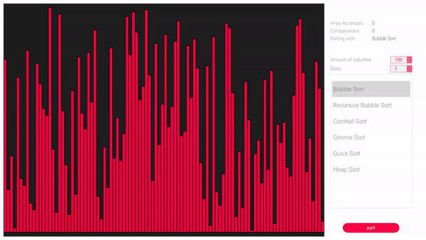
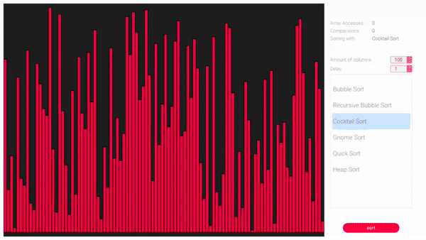
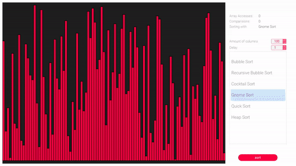
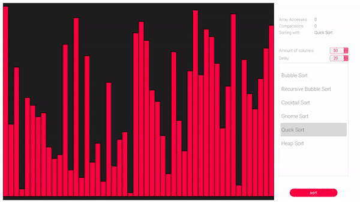
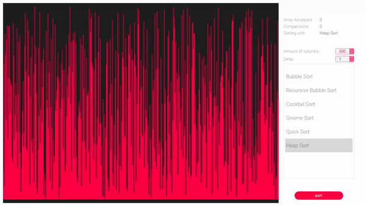

# 📊 Visualization of sorting algorithms

## 🚩 Table of Contents
- [About](#-about)
- [Install](#-install)
    - [Download](#download)
- [Usage](#-usage)
- [Examples](#-examples)
- [License](#-license)

## 🎨 About

Sorting algorithms visualizer written with C++ using QT for learning purposes. I wanted to improve in this technology/framework so I decided to write a project like this. Furthermore I found it really interesting to be able seeing the most popular algorithms in action on your screen.

That's also one of programming tasks from <a href="https://github.com/letelete/Programming-challenges">this list</a>

## Install

All of available install methods are listed below.

### Download

<a href="https://drive.google.com/drive/folders/1-ZPC9MzLk_9sg7wD6JY8_t5UJLziFos_?usp=sharing">click me to visit download site</a> 

#### Instruction
1. Download software
2. Run .exe file
3. Enjoy!

## 🎮 Usage

Playing with app is nothing, but piece of cake! 🍰

**All you need to do is:**
* **select** sorting algorithm which you would like to see in the action
* (optional) **specify** amount of columns and delay (ms)

## 💡 Examples

There's some preview of sorting alogorithms in action.

Cocktail Sort - 100 columns 1 ms | Gnome Sort - 100 columns 1 ms
:----------------------------:|:----------------------------:
 | 

Quick Sort - 50 columns 20 ms | Heap Sort - 500 columns 1 ms
:----------------------------:|:----------------------------:
 | 

<a href="https://www.youtube.com/watch?v=ClpMRMi8ikQ&feature">
Watch YouTube video for more!
</a>

## 📜 License
This software is licensed under the [MIT](https://github.com/nhnent/tui.editor/blob/master/LICENSE)
